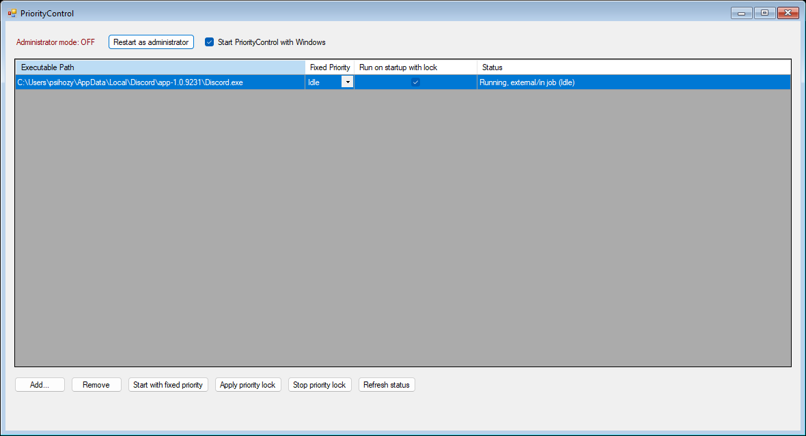

# PriorityControl
Легкая программа для Windows 11/10 которая умеет фиксировать приоритеты процессов.

Главная идея PriorityControl это решить баг Discord, из‑за которого программа периодически само поднимает свой приоритет до высокого/High, когда это происходит, игры начинают лагать и выдавать статтеры. Технически проблему можно решить вручную, каждый раз когда заходишь в звонок, включаешь демонстрацию экрана или просто запускаешь Discord, нужно открывать диспетчер задач и вручную ставить ему приоритет низкий/Idle, но это неудобно, занимает время и приходится повторять процедуру снова и снова. PriorityControl автоматизирует это. Ты один раз добавляешь Discord.exe в список, выбираешь нужный приоритет (например, низкий/Idle) и включаешь автозапуск. После этого программа сама запускает Discord с фиксированным приоритетом при каждой загрузке системы, никаких больше лишних действий не надо. При этом было бы странно делать утилиту только ради Discord, поэтому я реализовал поддержку нескольких программ, PriorityControl может фиксировать приоритет для любого количества приложений, а не только для дискорда. Также я решил что пользователям не во всех сценариях понадобиться фиксация приоритета постоянно, по этому я добавил две кнопки Apply priority lock и Stop priority lock, эти две кнопки изменяют фиксацию динамически на ходу, то есть программа которую вы выбрали не будет закрываться или завершать свои процессы если вы будете изменять priority lock. 

Почему не Procces Lasso? Я не хотел мусорить свою систему не портабельной, платной, более тяжелой для системы программой. Та и Procces Lasso отличаеться гораздо ресурсоемкой логикой фиксации чем у PriorityControl он следит за приоритетом процессов и делает это циклически, через свой сервис, то есть не на уровне ядра, а это плохо и дискорд все равно на 50–500 мс будет на высоком приоритете перед тем как Procces Lasso поменяет приоритет обратно на низкий, Discord может просто успеть вызвать статтер в игре, а PriorityControl один раз на мертво фиксирует приоритет и не потребляет ресурсы пк. та это угар полный, обычный powershell скрипт сделает тоже самое что и Procces Lasso, БУКВАЛЬНО с такой же логикой XD.

А что по античитам? PriorityControl не может вызвать проблем с античитом по одной простой причине: он работает только с классом приоритета процесса через стандартные API Windows. Это абсолютно легальная и штатная функция ОС, которая не вмешивается в память игры, не модифицирует её код и не взаимодействует с драйверами, но проблемы с античитом могут возникнуть только если сам античит решит использовать Job Object для контроля приоритетов (любая программа которая сама умеет вызывать Job Object не будет работать с PrioriryControl) или начнёт трактовать любое вмешательство в системные параметры процесса как подозрительное. Но это уже вопрос к логике античита, а не к PriorityControl.
